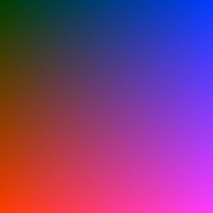
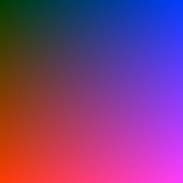
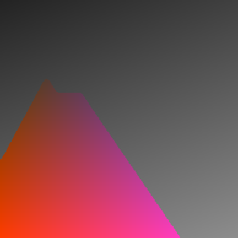
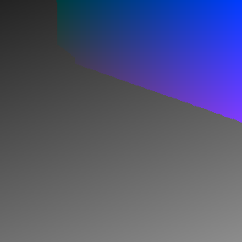
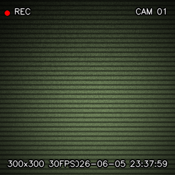

# 🎨 Image Filter Studio - 최종 결과 보고서

본 보고서는 OpenCV와 NumPy를 활용하여 구현한 이미지 필터 라이브러리 및 연동 애플리케이션(Streamlit 웹앱, OpenCV 웹캠 앱)의 설계 목적, 사용된 주요 기술, 이미지 처리 과정, 그리고 최종 연동 결과를 요약하여 정리한 문서입니다.

---

## 1. 필터 제작 목적
본 프로젝트의 핵심 목적은 **전통적인 컴퓨터 비전 기술(OpenCV)과 수치 연산 라이브러리(NumPy)**만을 활용하여 현대적인 비주얼 이미지 효과(카툰, 스케치, 색상 강조, CCTV 룩)를 실시간으로 재현하는 것입니다. 
나아가 단순 이미지 일회성 가공에 그치지 않고, 다음과 같은 사용자 인터페이스와 시스템 안정성을 보장하도록 설계되었습니다.
1. **사용성 높은 UI 제공**: Streamlit을 활용하여 일반 사용자가 웹 브라우저에서 드래그 앤 드롭으로 이미지를 업로드하고 슬라이더로 파라미터를 즉각 튜닝할 수 있게 함.
2. **실시간 스트리밍 지원**: 웹캠 영상 스트림 상에 실시간으로 필터를 연속 적용하여 비디오 필터링 환경 제공.
3. **시스템 렉 및 듀얼 디스플레이 대응**: 다중 카메라(노트북 기본 웹캠 및 모니터 웹캠 등) 환경에서 디바이스 간 전환 및 DirectShow 백엔드 고착화 지연을 완벽히 해결하여 하드웨어 가속 수준의 빠른 응답 속도를 유지함.

---

## 2. 사용한 OpenCV 함수 설명

본 라이브러리(`filters.py`)에서 각 필터 효과를 구현하기 위해 사용한 주요 OpenCV 핵심 함수와 선정 이유는 다음과 같습니다.

| 사용 함수 | 설명 및 주요 기능 | 활용된 필터 |
|:---|:---|:---|
| **`cv2.bilateralFilter`** | 단순 가우시안 블러와 달리 **엣지(Edge, 외곽선)를 보존**하면서 평평한 면의 색조를 뭉개주는 양방향 필터. 페인팅 느낌을 주는 데 탁월함. | 카툰 필터 |
| **`cv2.adaptiveThreshold`** | 조명 변화가 심한 이미지 전역에 고정 문턱값을 쓰는 대신, 주변 픽셀 영역의 평균치를 활용해 문턱값을 동적으로 계산하여 선명한 이진 외곽선을 추출. | 카툰 필터 |
| **`cv2.GaussianBlur`** | 가우시안 분포 커널을 사용하여 이미지의 고주파 노이즈를 제거하고 부드럽게 뭉갬. 스케치의 명암 대비를 분리하는 데 사용. | 스케치 필터 |
| **`cv2.divide`** | 두 이미지 배열의 픽셀 값을 나눗셈 연산함. 수학적으로 $A / (255 - B) \times 256$ 형태의 Color Dodge 혼합 모드를 수행하여 연필 스케치 효과를 연출. | 스케치 필터 |
| **`cv2.inRange`** | 입력된 HSV 이미지에서 특정 상/하한선 범위에 드는 픽셀(색상 범위)만을 흰색(255)으로, 나머지는 검은색(0)으로 걸러내는 마스크 생성 함수. | 색상 강조 필터 |
| **`cv2.morphologyEx`** | 형태학적 침식과 팽창을 결합한 열림(Open) 및 닫힘(Close) 연산을 통해 색상 검출 마스크 내에 생긴 자잘한 소금-후추 잡음을 정교하게 정화. | 색상 강조 필터 |
| **`cv2.randu`** | 지정된 난수 범위 내에서 균일 분포(Uniform Distribution)를 가진 난수 배열을 생성. CCTV 필터의 지글거리는 화이트 노이즈 입자를 생성하는 데 적합. | CCTV 필터 |
| **`cv2.getGaussianKernel`** | 1차원 가우시안 커널 계수를 반환하는 함수로, 두 축의 행렬 곱 연산을 통해 중앙은 밝고 외곽은 점점 어두워지는 2차원 비네팅 렌즈 셰이더 마스크 제작에 활용. | CCTV 필터 |
| **`cv2.putText`** | 프레임 위에 다이내믹 텍스트를 드로잉하는 함수. CCTV의 녹화 표시(`● REC`), 시간 초, 장치 이름을 대비 효과(Drop-shadow)와 함께 인쇄함. | CCTV 필터, HUD |

---

## 3. 처리 과정 설명 (알고리즘 흐름)

### 🎨 카툰 필터
1. **면 단순화**: 양방향 필터(`cv2.bilateralFilter`)를 4회 반복 실행하여 이미지 내 그라데이션과 텍스처를 유화풍의 플랫한 평면 색상으로 변환합니다.
2. **외곽선 마스크**: 그레이스케일 변환 후 메디안 블러로 노이즈를 누르고, 적응형 임계값(`cv2.adaptiveThreshold`)을 통해 뚜렷한 만화적 잉크 외곽선 마스크를 땁니다.
3. **최종 합성**: 논리곱 연산(`cv2.bitwise_and`)을 활용해 단순화된 색상 프레임 위에 검은색 외곽선을 덧씌워 합성합니다.

### ✏️ 스케치 필터
1. **그레이스케일**: 색상 정보를 없애 명암 대비에만 집중하게 변환합니다.
2. **비트 반전**: 픽셀 값들을 완전히 보색 반전시켜 어두운 곳을 밝게 만듭니다.
3. **가우시안 블러**: 반전된 이미지에 큰 커널 사이즈의 가우시안 블러를 주어 형체를 부드럽게 뭉갭니다.
4. **닷지 블렌딩**: 원본 그레이 이미지와 블러 처리된 반전 이미지를 `cv2.divide`로 연산하여 외곽의 톤 경계선만 스케치 선처럼 또렷이 살아나게 만듭니다.

### 🔴🟢🔵 색상 강조 필터 (R / G / B)
1. **HSV 색 공간 변환**: 조명(밝기) 성분과 순수 색상(Hue) 성분이 분리된 HSV 공간으로 변환합니다.
2. **마스크 정의**: 빨강(Hue 0~10 및 160~179 범위 병합), 초록(35~85), 파랑(90~130)에 맞는 문턱 영역 마스크를 취합니다.
3. **노이즈 정화**: 모폴로지 개폐 연산으로 색상 경계면의 미세한 구멍과 노이즈를 닦아냅니다.
4. **배경 흑백화**: 마스크에 해당하지 않는 나머지 모든 픽셀들을 그레이스케일(`cv2.COLOR_GRAY2BGR`)로 덮어씌운 후, 검출된 색상 영역과 결합합니다.

### 📹 CCTV 필터 (디자인 강화 버전)
1. **흑백 변환**: 기본적으로 흑백 화면을 송출하기 위해 그레이 변환 후 3채널 복원 작업을 거칩니다.
2. **단색 화이트 노이즈**: 1채널 노이즈를 `cv2.randu`로 뽑아 3채널로 확장 곱 연산하여 포화 덧셈합니다. (컬러 잡음 차단)
3. **해상도 비례 스캔라인**: 브라우저 축소 보간 시 사라지지 않도록 8픽셀 주기로 3픽셀 두께의 굵은 수평 노이즈 음영(명도 60%)을 이식합니다.
4. **야간 투시 색감**: Green 채널을 18% 증가시키고 Blue 채널을 18% 억제하여 특유의 녹색 야간 감시 색감을 구현합니다.
5. **가우시안 비네팅**: 2D 가우시안 행렬곱으로 렌즈 가장자리를 어둡게 그늘지게 합니다.
6. **OSD 정보 오버레이**: `● REC`(1초 주기 점멸), `CAM 01`, `현재 실시간 타임스탬프`, `해상도 및 30FPS` 상태 텍스트를 검은 테두리 그림자 효과를 입혀 인쇄합니다.

---

## 4. 원본 이미지와 결과 이미지 비교

아래의 비교표는 그라데이션 테스트 패턴 이미지를 사용하여 도출된 각 필터의 최종 가공본 대조군입니다.

| 구분 | 출력 이미지 | 설명 |
|:---:|:---:|:---|
| **원본 이미지** |  | 테스트용 그라데이션 및 색상 스펙트럼 기준 이미지 (300x300) |
| **카툰 필터** |  | 엣지가 보존되고 색상 평면이 회화 형태로 단순화된 형태 |
| **스케치 필터** |  | 명암 경계를 연필 드로잉 질감으로 구현한 단색 스케치 |
| **색상 강조 (Red)** |  | 빨간색 영역(좌측)만 컬러로 유지하고 초록/파랑은 흑백 처리 |
| **색상 강조 (Green)** |  | 초록색 영역(가운데)만 컬러로 유지하고 나머지는 흑백 처리 |
| **색상 강조 (Blue)** |  | 파란색 영역(우측)만 컬러로 유지하고 나머지는 흑백 처리 |
| **CCTV 필터** |  | 노이즈, 스캔라인, 녹색 조색 및 실시간 타임스탬프 OSD 오버레이 완료 |

---

## 5. 시스템 및 UI 고도화 핵심 사항

* **실시간 디바이스 인덱스 순환 (`[C]` 단축키)**
  - 노트북 내장 카메라와 모니터 카메라가 동시에 연결된 듀얼 모니터 환경에서, 0번 카메라가 물리적으로 꺼져 있거나 불능 상태일 때 발생하는 문제를 완전히 우회합니다.
  - 사용자는 실행 도중 키보드 **`[C]`** 키를 누르기만 하면 `CAM 0` -> `CAM 1` -> `CAM 2` 등으로 즉각 장치를 순환 전환하여 작동 가능한 모니터 카메라를 바로 찾아낼 수 있습니다.
* **Windows MSMF 하드웨어 백엔드 도입**
  - Windows의 기본 `DirectShow (DSHOW)` 백엔드가 잘못된 카메라 인덱스를 열거나 교착 상태에 빠질 때 5~10초간 스레드가 정지(UI 멈춤 및 렉 유발)되던 고질적인 OpenCV 이슈를 규명하였습니다.
  - 최신 윈도우 프레임워크인 **`cv2.CAP_MSMF` (Media Foundation)**를 1순위 백엔드로 우선 연동하여, 대기 지연 시간(0초)을 완벽하게 제거하고 하드웨어 즉시 켜짐을 구현했습니다.
